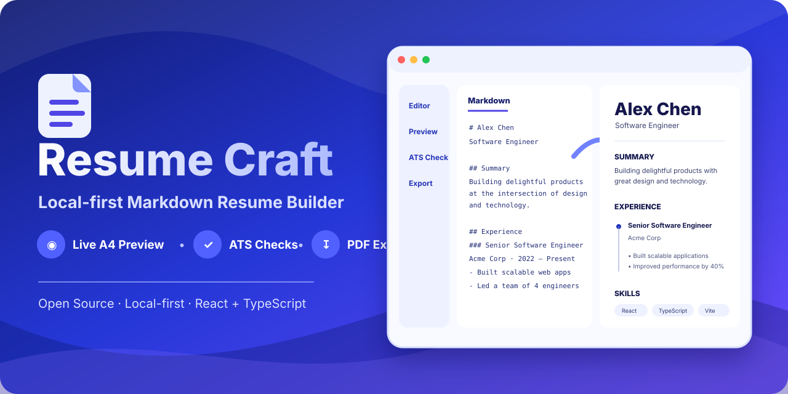

<h1 align="center">🚀 Resume Craft · 简匠简历</h1>

<h3 align="center">Local-first Markdown Resume Builder</h3>

<p align="center">
  本地优先的 Markdown 简历编辑器：实时 A4 预览、ATS 检查、中英双语、PDF 导出。
</p>

<p align="center">
  <a href="https://kunlong-luo.github.io/resume-craft/"><strong>在线体验</strong></a>
  ·
  <a href="./README.en.md">English</a>
  ·
  <a href="https://github.com/kunlong-luo/resume-craft/discussions">反馈 / Discussions</a>
  ·
  <a href="https://github.com/kunlong-luo/resume-craft/releases/latest">Latest Release</a>
</p>

<p align="center">
  <a href="https://kunlong-luo.github.io/resume-craft/"></a>
  <a href="https://github.com/kunlong-luo/resume-craft/actions/workflows/ci.yml"></a>
  <a href="https://github.com/kunlong-luo/resume-craft/releases/latest"></a>
  <a href="./LICENSE"></a>
</p>

<p align="center">
  
</p>


> **Resume Craft** 面向希望摆脱 Word 排版负担的求职者和开发者。它把 Markdown 的高效编辑、结构化表单和 A4 实时预览放在同一个本地优先工作流里，无需注册即可开始制作简历。
>
> **Markdown ↔ Form · Live A4 Preview · ATS Checks · Auto Fit · PDF Export · Local-first · PWA**
>
> 简历草稿与设置主要保存在浏览器本地；ATS 检查、排版工具和 PDF 导出都在前端完成。需要分享时，也可以生成带可选访问口令的链接。

---

## 💡 为什么选择 Resume Craft？

在传统的简历制作中，求职者常常面临 **Word 对齐地狱**、**PDF 导出乱码错位**、**“1.1 页”尴尬超页** 以及 **跨设备字体变形** 等痛点。Resume Craft 针对这些问题构建了一整套极客级解决方案：

```
+-----------------------------------------------------------------------------------+
|                                  RESUME CRAFT                                     |
|                                                                                   |
|  [ 可视化结构表单 ] <==========( 实时双向 AST 引擎 )==========> [ Markdown 源码 ]    |
|          |                                                             |          |
|          +---------------------> [ A4 画布渲染底座 ] <-----------------+          |
|                                         |                                         |
|    +------------------------------------+-----------------------------------+    |
|    |                                    |                                   |    |
| [ 1-Click 智能压缩贴合 ]    [ 高保真系统字体降级 Stack ]      [ ATS 岗位词库诊断匹配 ]|
|    |                                    |                                   |    |
|    +------------------------------------+-----------------------------------+    |
|                                         |                                         |
|                   +---------------------+---------------------+                   |
|                   |                                           |                   |
|         [ PDF 下载 / 浏览器打印 ]                    [ H5 分享链接 / QR 码 ]       |
+-----------------------------------------------------------------------------------+
```

---

## 🌟 核心杀手级特性

### 1. 🔄 可视化表单 & Markdown 双向同步引擎
* **双域联动**：无论是在左侧「结构化表单」修改姓名职位，还是在「Markdown 源码」编辑项目细节，简历画布会实时更新，保持表单、Markdown 与预览内容同步。
* **拖拽重排**：表单组件内置 Grip 抓手，鼠标拖拽即可秒级调整项目经历或技能板块排序，Markdown 源码与预览图同步完成文本段落重组。

### 2. ⚡ 顶栏「一键压缩贴合」（1-Click Auto Fit）与 A4 控页
* **消除溢出**：拒绝“1.1 页”尴尬断层！闪电按钮自动级联微调页边距（Margin）、字体行高（Line Height）与段落间距（Spacing），将溢出内容平滑贴合至整齐 1 页纸内。
* **物理辅助刻度**：提供 A4 标准尺寸边界线与物理折页指示线，直观掌控纸张空间。

### 3. ✨ 杂乱纯文本智能导入（Smart Raw Text Importer）
* **一键识别**：直接粘贴来自招聘网站（BOSS/猎聘）、旧 Word 或 PDF 的杂乱纯文本，本地轻量算法自动识别姓名、联系方式、工作经历与技能模块并规整为标准 Markdown。

### 4. 🎯 ATS 岗位匹配与智能诊断系统
* **JD 契合度匹配**：粘贴目标岗位 Job Description，算法智能对比核心匹配度关键词，突出显示核心技能短板。
* **排版与合规自检**：实时扫描联系方式遗漏、多段经历时间重叠冲突及技术词汇规范大小写（如将 `react` / `node` 建议修正为 `React` / `Node.js`）。

### 5. ✍️ 一键中英排版空格优化 (Bilingual Spacing)
* **排版美学**：依据中文排版规范，一键自动在中文与英文、数字之间插入美学空格（如 `熟练使用React开发` ➔ `熟练使用 React 开发`），大幅增加文本呼吸感。

### 6. 🎨 行业专属主题色盘与模版定制
* **多维排版**：内置科技靛蓝、金融墨绿、极客深黑等行业色盘；支持单双栏布局切换、基础字号（13/14/15px）、行高段距及多种二级标题下划线风格定制。

### 7. 🔤 系统字体栈与 A4 比例一致性 (Font & A4 Consistency)
* **跨端一致性设计**：使用 PingFang SC、Microsoft YaHei、Source Han Sans 等系统降级字体链，并基于 `794px × 1123px` 的 A4 画布与视口缩放，尽量减少不同浏览器与系统之间的排版差异。实际字体度量仍可能因平台环境产生轻微变化。

### 8. 💾 多档案草稿矩阵 (Profile Matrix) 与差异对比
* **一职一简历**：快速克隆创建特定岗位版本（如 `前端开发版`、`全栈工程师版`）。
* **Diff 差异对比**：提供左右侧两版本模块级差异对比面板，清晰高亮文本修改与关键字调整。

### 9. 🔒 H5 外链分享与可选访问口令
* **便捷分享**：简历内容会编码进分享 URL，可设置客户端访问口令作为查看门槛，并提供二维码预览。当前分享机制不是端到端加密；任何拿到完整分享链接的人都应被视为可能读取其中的数据。

### 10. 📐 板块位置极速排序 (Section Sorter)
* **模块重排**：自动识别 Markdown 中的二级标题板块，支持拖拽或一键上下平移整个章节，无须手动繁琐剪切粘贴。

### 11. 🌙 深色模式与 A4 纸张隔离
* **视觉舒适**：全站配备低疲劳深色模式，同时建立简历画布与导出 PDF 的样式强隔离机制，确保深色模式下预览纸张始终保持清晰白底黑字。

### 12. 🌐 全局中英双语国际化 (Bilingual Localization)
* **极速切换**：一键无缝切换中文（zh）与英文（en），不仅界面文案，内置简历模版与诊断提示亦全面中英适配。

### 13. ⚡ PWA 离线运行与本地优先数据存储
* **本地优先**：支持安装至桌面与移动端。编辑中的简历与设置保存在浏览器本地存储中，项目本身不提供用于保存简历内容的应用后端。新分享链接使用 URL fragment 保存载荷，仍应只分享给可信接收者。

---

## 📂 源码目录结构

```
.
├── .github/
│   ├── dependabot.yml           # Dependabot 依赖每周自动巡检
│   └── workflows/
│       ├── ci.yml               # GitHub Actions CI 检查与测试
│       ├── deploy.yml           # main 分支自动部署 GitHub Pages
│       ├── release.yml          # package.json 版本变更后自动发布稳定版
│       ├── seo-submit.yml       # 部署成功后可选提交 IndexNow
│       └── promote.yml          # 新内容跨平台推广（默认 dry-run）
├── src/
│   ├── assets/                  # 静态资源与矢量图形
│   ├── components/              # UI 组件分层架构
│   │   ├── form/                # 可视化简历结构表单
│   │   ├── layout/              # 顶栏、侧边栏与分栏容器
│   │   ├── modals/              # ATS 诊断、密码锁、草稿对比弹窗
│   │   ├── preview/             # A4 画布渲染器与 ZoomControls
│   │   ├── share/               # H5 外链分享访问端组件
│   │   └── toolbar/             # 快捷工具栏与 AutoFit 按钮
│   ├── context/                 # 全局 Context 与 Provider
│   ├── data/                    # 示例模板与中文/英文初始简历
│   ├── hooks/                   # 自定义 React Hooks (A4测量, 快捷键)
│   ├── i18n/                    # 中英双语国际化词条
│   ├── lib/                     # 核心算法 (AST解析, 贴合算法, 分享与存储工具)
│   ├── store/                   # Zustand 全局响应式状态管理
│   ├── types.ts                 # TypeScript 强类型定义
│   ├── index.css                # Tailwind CSS v4 & 全局 CSS 变量
│   └── main.tsx                 # 应用入口点
├── index.html                   # HTML 模板入口
├── package.json                 # 依赖配置与运行脚本
├── vite.config.ts               # Vite 8 打包构建配置
└── README.md                    # 项目说明文档
```

---

## 🛠️ 技术栈与依赖库

| 领域 | 技术方案 | 优势 / 说明 |
| :--- | :--- | :--- |
| **前端框架** | [React 19](https://react.dev/) + [TypeScript 7](https://www.typescriptlang.org/) | 极致性能与强类型安全 |
| **构建工具** | [Vite 8](https://vite.dev/) | 毫秒级 HMR 与极速生产打包 |
| **样式引擎** | [Tailwind CSS v4](https://tailwindcss.com/) | 新一代 CSS 变量与极简原子化样式 |
| **状态管理** | [Zustand 5](https://github.com/pmndrs/zustand) | 轻量响应式状态，支持 LocalStorage 持久化 |
| **动效系统** | [Motion 13](https://github.com/framer/motion) | 流畅弹窗、拖拽重排与平滑展开动画 |
| **Markdown** | `react-markdown` + `remark-gfm` | 标准 GFM 语法高能解析 |
| **PDF 导出** | 浏览器原生打印 + `html2canvas-pro` + `jspdf` | 直接 PDF 下载 + 系统打印 / Save as PDF 双路径 |
| **图标库** | [Lucide React](https://lucide.dev/) | 矢量现代线条图标 |

---

## 🚀 开发者快速启动指南

### 1. 克隆项目
```bash
git clone https://github.com/kunlong-luo/resume-craft.git
cd resume-craft
```

### 2. 安装依赖
```bash
pnpm install
```

### 3. 启动开发服务器
```bash
pnpm dev
```
打开浏览器访问 [http://localhost:3000](http://localhost:3000) 即可开始开发调试。

### 4. 运行工程脚本

| 脚本命令 | 说明 |
| :--- | :--- |
| `pnpm dev` | 启动 Vite 开发服务器（Port: 3000） |
| `pnpm build` | 构建生产环境产物（dist 目录） |
| `pnpm lint` | 运行 TypeScript 全量静态类型检查 |
| `pnpm test` | 执行 Vitest 自动化单元测试 |
| `pnpm preview` | 预览本地生产打包结果 |
| `pnpm check:stable-deps` | 检查直接依赖是否全部为稳定版本 |

---

## 📈 PDF 下载与打印指南

Resume Craft 提供两条导出路径：

1. **直接下载 PDF（默认）**：点击顶部 **“下载”**，使用 `html2canvas-pro + jsPDF` 在浏览器中生成 PDF 文件。
2. **浏览器打印 / Save as PDF**：使用 **Ctrl/Cmd + P** 调起原生打印流程，更适合希望使用浏览器打印引擎的场景。

撰写时可以配合 **A4 辅助线** 与 **一键压缩贴合** 检查分页。如果使用系统打印窗口（Chrome / Edge / Safari），建议：

* **目标打印机**：选择 `另存为 PDF` (Save as PDF)
* **纸张大小**：选择 `A4`
* **边距**：根据预览结果优先尝试 **`无` (None)**
* **选项**：需要保留主题背景时勾选 **`背景图形` (Background graphics)**
* **页眉和页脚**：建议取消勾选

---

## ❓ 常见问题 FAQ

<details>
<summary><b>Q1: 我的个人简历数据会被上传到后端服务器吗？</b></summary>
<b>答：</b>编辑器本身没有用于保存简历内容的应用后端；当前草稿与设置主要保存在浏览器 `localStorage` 中，并非加密存储。请把浏览器账户、设备和本地备份视为敏感数据环境。
</details>

<details>
<summary><b>Q2: 生成的 H5 分享链接安全性如何？</b></summary>
<b>答：</b>当前实现会把简历数据编码到分享 URL 中，并可设置客户端访问口令。该口令是查看门槛，不等同于密码学加密；拿到完整链接的人应被视为可能访问其中的数据。请不要通过分享链接传递不必要的敏感信息。
</details>

<details>
<summary><b>Q3: 为什么换电脑后排版通常还能保持比较一致？</b></summary>
<b>答：</b>项目使用跨平台系统字体降级链，并以固定 A4 画布基准配合视口缩放来减少差异。不同操作系统、浏览器和本机字体度量仍可能造成轻微变化，因此重要投递建议以最终导出的 PDF 为准。
</details>

---

## 🔐 隐私与安全边界

Resume Craft 采用本地优先架构，但“本地优先”不等于“所有数据都经过加密”。

- 编辑中的简历、设置和档案主要保存在浏览器 `localStorage` 中。
- 项目本身不提供用于持久化简历内容的应用后端。
- 字体使用本机系统字体栈，不从 Google Fonts 等第三方字体 CDN 加载。
- 产品使用 Simple Analytics 统计少量匿名聚合指标（开始编辑、导出、ATS 匹配、Auto Fit、分享、PWA 安装与反馈入口）；事件只有固定事件名，不附带 metadata。尊重 Do Not Track，开启 DNT 时不会加载统计脚本；不发送简历、JD、联系方式、文件名、分享参数或访问口令，也不启用会话回放/指纹识别。
- 新分享链接把简历内容编码进 URL fragment，不会作为请求查询参数发送给托管站点；旧版 `?share=` 链接仍兼容。访问口令是客户端查看门槛，不是端到端加密。
- 不要在 Issue、PR、测试数据或截图中提交真实简历、访问令牌、密码或其他敏感信息。
- 产品建议与使用反馈可前往 [GitHub Discussions](https://github.com/kunlong-luo/resume-craft/discussions)；不会自动附带任何简历内容。
- 安全问题请按照 [SECURITY.md](SECURITY.md) 的私密报告流程处理。

---

## 🤝 参与贡献与社区

欢迎提交 Bug、功能建议和代码贡献。在开始之前，请先阅读：

- [贡献指南](CONTRIBUTING.md) — 开发环境、提交规范和 PR 流程
- [行为准则](CODE_OF_CONDUCT.md) — 社区协作规则
- [安全策略](SECURITY.md) — 漏洞请通过私密渠道报告，不要公开提交敏感细节
- [支持说明](SUPPORT.md) — Bug、功能建议和使用问题的处理方式

提交 Pull Request 前，请确保 `pnpm lint`、`pnpm test` 和 `pnpm build` 均通过。

---

## 📄 开源许可证

本项目采用 [MIT License](LICENSE) 开源许可证。您可以自由地在个人、团队或商业项目中修改和使用。
